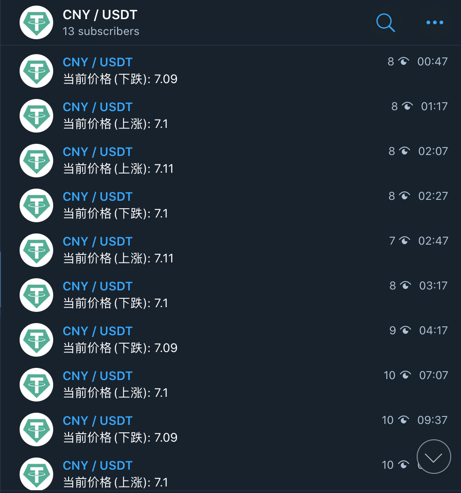
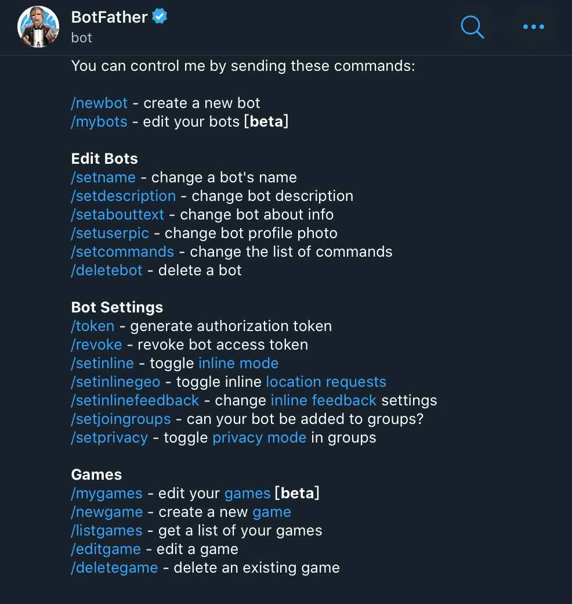

<!--
 * @Author: your name
 * @Date: 2020-02-26 11:46:07
 * @LastEditTime: 2020-05-30 23:05:17
 * @LastEditors: Please set LastEditors
 * @Description: In User Settings Edit
 * @FilePath: /earn_money/telegram_bots/README.md
 -->

 # Telegram 监控机器人

 之前炒过一段时间的货币，但是通常很难跟着行情，如果不能掌握行情，也比较难赚到钱。
 已经时隔两年了，目前不再炒币了，之前用的币价机器人开源出来，仅供学习。

 **不仅仅是可以用于币价监控，扩展之后还可以使用在其他的场景，比如运维监控等**。

 主要是为了监控货币价格的变化，可以自己根据需要扩展，支持主动获取币价和监控条件触发：
 1. 获取当前某个货币的价格
 2. 当某个货币的价格到达某个水位之后，发送 TG 消息到频道

## 功能列表

1. 获取 USDT 的交易价

## 部分截图



## 运行

脚本使用 python3 编写，需要配合 Telegram 一起运行，申请 Telegram 机器人或者频道，见下文介绍。
``` shell
git clone ...
pip3 install -r requirements.txt
python3 main.py
```

## 申请 Telegram Token

Telegram 如果需要主动获取消息，比如不等机器人推送自己获取消息，需要向 @BotFather 申请一个机器人:



按照上面的指引穿件一个以`_bot`结尾的机器人，然后@BotFather 会发送给你一个 APITOKEN。

## 和机器交互

申请完成机器人之后，你就可以和机器人交互了，将你的 token 填入代码中并运行，目前有的命令只有一个：
- /usdt

## 创建频道

创建频道比较简单，直接在 Telegram 界面上就可以找到，创建完成之后将自己的机器人拉入频道中。

## 将机器人加入频道

机器人添加进频道之后就可以通过机器人自动的更新消息，比如我们说的某个货币的价格满足条件就推送到频道里面。

具体的方法是联系 @ControllerBot，这个机器人可以帮你把你的机器人和频道关联起来。

发送 /addchannel 给 @ControllerBot 机器人，然后将你的 Token 发送给他。

发送完成按照提示去你的频道发送一个消息，然后将这条消息转发给@ControllerBot，那么你的频道绑定就完成，此时就可以通过机器人推送消息到频道。

## 扩展

目前我这个机器人比较简单，那么如何扩展了，可以支持的扩展功能主要有两种：
- 添加命令，也就是你可以主动通过机器人触发
- 添加监控，也就是后台定时执行然后通过频道推送

### 添加命令

参考 /handlers/commands.py 实现

### 添加监控

参考 /timer.py,发送消息的时候需要填写你的channel id,具体的获取办法是通过 bot 的测试api:

```text
https://api.telegram.org/bot{your_bot_token}/sendMessage?chat_id=@{your_channel_name}&text=123
```

消息发送成功之后，你可以看到自己频道的 ID。

## 扩展阅读

- [telegram 爬虫](https://mp.weixin.qq.com/s/fSJOBZAzVwXjrG-Xbn_wPg)